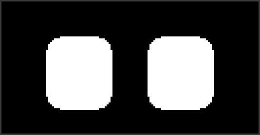

# Desk Buddy



An EMO-style animated face for an **ESP32-C3 Super Mini** and a **0.96"
SSD1306 OLED**. Two parts, four wires, and a little robot that sits on your
desk, looks around the room, gets bored of you, and falls asleep if you ignore
it for five minutes.

It is eyes only, on purpose - that is most of what makes EMO read as a
character rather than a cartoon. No mouth to get wrong.

## What it does

Twelve expressions - neutral, happy, excited, sad, angry, surprised, sleepy,
love, curious, suspicious, dizzy, bored - and it eases between them instead of
cutting. Every change hides behind a blink: the lids shut, the shape swaps,
the lids open. That single trick is most of why it reads as alive rather than
as a slideshow.


Left alone, it runs itself. A weighted mood table picks what to feel next
(mostly calm, with the occasional bit of drama) while the eyes saccade to
random points, with a standing chance of glancing back at whoever is sitting
in front of them. Blinks close fast and open slow at random intervals, and
sometimes come in quick pairs, because real ones do. A sub-pixel idle bob
keeps it from ever being completely still. Ignore it for 90 seconds and it
gets visibly bored; five minutes and it nods off and the panel dims.

Interrupt it and it notices. A poke startles it - shake, exclamation marks,
then it cheers up. A pat makes it squint up at your hand and throw hearts, and
if you keep going for about three seconds it is smitten. There are floating
Z's while it sleeps, tears when it is sad, a nervous sweat drop, and spiral
eyes when it is dizzy.

Put it on WiFi and it also **glances at the weather** every so often - six
seconds of sun, rain, snow, fog or a thunderstorm animated around the matching
face, with the temperature small in the corner - and you get a **web page** to
poke it, change its expression and adjust its settings from your phone.

The whole face also wanders a few pixels on two slow periods that never line
up. A bright static image on an OLED all day is exactly how you etch a panel.

## Parts

| | |
| --- | --- |
| ESP32-C3 Super Mini | the one you have |
| 0.96" SSD1306 128x64 I2C OLED | the Hosyond 5-pack - you have four spares for the next one |
| 4 jumper wires | |
| USB-C cable | |

Optional: a TTP223-style capacitive touch pad (one wire, and it becomes the
buddy's head), a printed case (`hardware/case/`) and four M2x8 screws.

## Wiring

| OLED | ESP32-C3 |
| --- | --- |
| VCC | 3V3 |
| GND | GND |
| SDA | GPIO5 |
| SCL | GPIO6 |

That is the whole build. The **onboard BOOT button** (GPIO9) is the "poke me"
button, so there is nothing else to wire.

Have a touch sensor? `VCC -> 3V3`, `GND -> GND`, `SIG -> GPIO4`. Stick the pad
inside the top of the case and the head becomes touch sensitive with nothing
visible from outside.

[docs/WIRING.md](docs/WIRING.md) has the rest: why not the default I2C pins,
which TTP223 solder jumpers to leave alone, what to do when the panel glitches.

## Flashing it

### PlatformIO

```sh
pio run -t upload      # or: make flash
pio device monitor     # or: make monitor
```

`platformio.ini` pulls in the libraries and the toolchain. The Super Mini
shows up as a native USB CDC port - no drivers, no BOOT-button dance.

After that first flash, once it is on WiFi, updates go over the air:

```sh
pio run -e esp32-c3-supermini-ota -t upload
```

### Arduino IDE

1. Boards Manager: install **esp32** by Espressif Systems.
2. Library Manager: install **Adafruit SSD1306** (take the GFX and BusIO
   dependencies when it offers).
3. Board: **ESP32C3 Dev Module**. Set **USB CDC On Boot: Enabled** - without
   it the serial console stays silent.
4. Copy everything in `src/` into a sketch folder called `deskbuddy/`, and
   rename `main.cpp` to `deskbuddy.ino`.

## Playing with it

| BOOT button | |
| --- | --- |
| short press | poke it - startle, then cheer up |
| double press | hearts |
| long press | sleep / wake |

| Touch pad | |
| --- | --- |
| tap | "oh, hi" - looks at you, brightens up |
| double tap | playful - excited |
| hold | petting - squints up at your hand, hearts, and after ~3 s it's smitten |

A pat wakes it gently; a poke wakes it startled.

## Putting it on WiFi

```sh
cp src/secrets.example.h src/secrets.h   # fill in your 2.4 GHz network
pio run -t upload
```

It then answers at `http://deskbuddy.local`: the twelve expressions, poke /
pet / sleep, the weather, and settings that stick across reboots. Set your
latitude and longitude there and the weather glances start. Everything the
page does is also a four-endpoint API, so `curl -d 'emotion=angry&hold=5'
http://deskbuddy.local/api/notify` is all it takes to make a build failure
show on its face. [docs/WIFI.md](docs/WIFI.md) has the details, the OTA
password, and what each kind of weather looks like.

No `secrets.h` means no networking, and everything else works as before.

## Driving it over serial

115200 baud on the same USB port, line-based, `help` lists everything:

```
> happy
> look -1 0.3
> wink l
> auto on
```

Naming an emotion takes the buddy off autopilot so your expression sticks;
`auto on` gives it its own head back. Anything that can write to a tty can
drive it, which makes it easy to wire into something else - a failing build
can make it angry, a green one can make it happy. Full command list in
[docs/SERIAL.md](docs/SERIAL.md).

## Seeing it before you solder anything

The face renderer has no Arduino dependency, so the exact same code that runs
on the board also runs on your machine:

```sh
make preview        # preview/emotions.png and preview/timeline.png
make gif            # preview/deskbuddy.gif, the animation at the top (needs: pip3 install pillow)
```

`preview/preview arc angry out.bin` renders a single transition frame by
frame, which is the fastest way to judge a tweak.

`preview/web/index.html` is a small browser player for the same frames. Open
it locally, or regenerate it after a change:

```sh
python3 tools/host/make_web_preview.py preview/web
```

There is also a [Wokwi](https://wokwi.com) setup in `sim/` if you would rather
watch it run on a simulated board.

## How it works

```
src/
  main.cpp         Arduino glue: display init, frame pacing, button, serial
  config.h         pins and behaviour knobs - start here
  Face.h/.cpp      the eyes: expression table, blink, gaze, rendering
  Personality.*    what it does unsupervised: moods, boredom, sleep, reactions
  Effects.*        floating hearts / Z's / tears / sweat particles
  Shapes.*         heart, spiral, droplet, Z, star primitives
  Button.*         debounce, single / double / long press
  Weather.*        weather conditions and the WMO code mapping
  Net.*            WiFi, mDNS, over-the-air updates
  WebApp.*         the control page and its JSON API
  WebPage.h        the page itself, served from flash
  WeatherClient.*  Open-Meteo fetch on its own task
  Settings.*       runtime settings, kept in flash
  Easing.h         smoothing helpers and a deterministic RNG
  Gfx.h            one drawing surface, two backends (device / host preview)
tools/host/        the desktop renderer, a stdlib-only PNG writer, the GIF script
hardware/case/     parametric OpenSCAD case
docs/              wiring, serial protocol, tuning
```

An eye is one white rounded rectangle that then gets **carved**: a top lid
(slanted, which is what reads as an eyebrow), a bottom lid, and a circular
bite out of the bottom that turns it into a smiling arch. The carving is done
column by column rather than with polygons, so there are no seams and no
overdraw.

Everything visual is data. A `Pose` struct holds the eye size, lids, slant,
arc, tilt, gaze and the rest, and the renderer eases the live pose towards the
target every frame - so adding an expression means adding a row to a table,
not touching the renderer. [docs/TUNING.md](docs/TUNING.md) walks through
every field, plus blink feel and the boredom and sleep timings.

Frames are pushed at 30 fps over I2C at 800 kHz. A 128x64 frame is 1024 bytes,
so a push costs ~13 ms; at the more usual 400 kHz you would be stuck at about
half the frame rate.

## The case

`hardware/case/` has a parametric two-part OpenSCAD case: a bezel the OLED
drops into, and a shell that leans the face back about 14 degrees and holds
the Super Mini. Four M2x8 self-tapping screws hold it together, and the touch
pad tapes to the inside of the top wall.

It is untested on a printer, and 0.96" OLED modules vary by a millimetre
between batches, so put calipers on yours and check the dimensions first.
Measurements, print settings and the STL export commands are in
[hardware/case/README.md](hardware/case/README.md). Black filament makes the
bezel disappear around the display, which is most of the look.

## What's next

Ideas that aren't built yet - motion sensing so it looks towards movement,
a light sensor, a proper display-off sleep - are written up with enough
detail to pick up cold in [TODO.md](TODO.md).

## Status

Written and checked on a machine without the hardware attached. Everything in
`preview/` is rendered by the real `Face.cpp`. Every source file compiles
clean under `-Wall -Wextra` - the Arduino-free half for real on the host, the
Arduino half against stub headers - but the PlatformIO registry was blocked in
the environment this was written in, so the firmware has never been through a
full `pio run`, and it has never been flashed to a physical board.

If the first flash misbehaves, `status` over serial and
[docs/WIRING.md](docs/WIRING.md) are the places to start. The networking layer
was written the same way - checked against stub headers, never run on a
board - so the first `wifi: up` line on the console is the real test.
