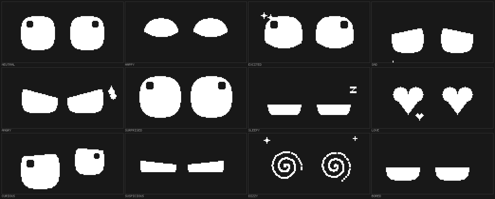

# Desk Buddy

An EMO-style animated face for an **ESP32-C3 Super Mini** and a **0.96"
SSD1306 OLED**. Two parts, four wires, and a little robot that sits on your
desk, looks around the room, gets bored of you, and falls asleep if you ignore
it for five minutes.



It is eyes only, on purpose - that is most of what makes EMO read as a
character rather than a cartoon. No mouth to get wrong.

## What it actually does

- **Twelve expressions**, each easing smoothly into the next: neutral, happy,
  excited, sad, angry, surprised, sleepy, love, curious, suspicious, dizzy,
  bored.
- **Blinks like a living thing** - fast close, slower open, random intervals,
  and an occasional quick double-blink, because real blinks come in clusters.
- **Expression changes hide behind a blink.** The lids shut, the shape swaps,
  the lids open. This one trick is why it doesn't look like a slideshow.
- **Looks around on its own** - saccades to random points, with a standing
  chance of glancing back at whoever is sitting in front of it.
- **Breathes.** A sub-pixel idle bob, so it is never completely still.
- **Has opinions.** A weighted mood engine picks what to feel next: mostly
  calm, occasionally dramatic. Ignored for 90 seconds and it gets visibly
  bored; five minutes and it nods off and the panel dims.
- **Reacts to being poked** - startle, shake, then cheer up.
- **Little flourishes**: floating Z's while asleep, hearts, a nervous sweat
  drop, exclamation marks, tears, spiral eyes when dizzy.
- **Anti burn-in drift**, because a bright static face on an OLED all day is
  exactly how you etch a panel.

## Parts

| | |
| --- | --- |
| ESP32-C3 Super Mini | the one you have |
| 0.96" SSD1306 128x64 I2C OLED | the Hosyond 5-pack - you have four spares for the next one |
| 4 jumper wires | |
| USB-C cable | |

Optional: a printed case (`hardware/case/`) and four M2x8 screws.

## Wiring

| OLED | ESP32-C3 |
| --- | --- |
| VCC | 3V3 |
| GND | GND |
| SDA | GPIO5 |
| SCL | GPIO6 |

That's it. The **onboard BOOT button** (GPIO9) is the "poke me" button, so
there is nothing else to wire. Full notes, including why not the default I2C
pins, are in [docs/WIRING.md](docs/WIRING.md).

## Flash it

### PlatformIO (recommended)

```sh
pio run -t upload      # or: make flash
pio device monitor     # or: make monitor
```

Libraries and the toolchain are pulled in automatically by
`platformio.ini`. The Super Mini shows up as a native USB CDC port - no
drivers, no BOOT-button dance.

### Arduino IDE

1. Boards Manager: install **esp32** by Espressif Systems.
2. Library Manager: install **Adafruit SSD1306** (take the GFX and BusIO
   dependencies when it offers).
3. Board: **ESP32C3 Dev Module**. Set **USB CDC On Boot: Enabled** - without
   it the serial console stays silent.
4. Copy everything in `src/` into a sketch folder called `deskbuddy/`, and
   rename `main.cpp` to `deskbuddy.ino`.

## Playing with it

| Button | |
| --- | --- |
| short press | poke it |
| double press | hearts |
| long press | sleep / wake |

Or drive it over USB serial at 115200 - `help` lists everything:

```
> happy
> look -1 0.3
> wink l
> auto on
```

Handy for wiring it into something else: a failing build can make it angry, a
green one can make it happy. See [docs/SERIAL.md](docs/SERIAL.md).

## Seeing it before you solder anything

The face renderer is deliberately free of any Arduino dependency, so the exact
same code that runs on the board also runs on your Mac:

```sh
make preview        # writes preview/emotions.png and preview/timeline.png
```

`preview/preview arc angry out.bin` renders a single transition frame by
frame, which is the fastest way to judge a tweak.

There is also a [Wokwi](https://wokwi.com) setup in `sim/` if you would rather
watch it run on a simulated board.

## How it works

```
src/
  main.cpp         Arduino glue: display init, frame pacing, button, serial
  config.h         pins and behaviour knobs - start here
  Face.h/.cpp      the eyes: expression table, blink, gaze, rendering
  Personality.*    what it does unsupervised: moods, boredom, sleep, reactions
  Effects.*        floating hearts / Z's / tears / sweat particles
  Shapes.*         heart, spiral, droplet, Z, star primitives
  Button.*         debounce, single / double / long press
  Easing.h         smoothing helpers and a deterministic RNG
  Gfx.h            one drawing surface, two backends (device / host preview)
tools/host/        the desktop renderer and a stdlib-only PNG writer
hardware/case/     parametric OpenSCAD case
docs/              wiring, serial protocol, tuning
```

An eye is one white rounded rectangle that then gets **carved**: a top lid
(slanted, which is what reads as an eyebrow), a bottom lid, and a circular
bite out of the bottom that turns it into a smiling arch. The carving is done
column by column rather than with polygons, so there are no seams and no
overdraw. Everything is driven by a `Pose` struct that the renderer eases
towards every frame - see [docs/TUNING.md](docs/TUNING.md) to add your own
expressions.

Frames are pushed at 30 fps over I2C at 800 kHz. A 128x64 frame is 1024 bytes,
so a push costs ~13 ms; at the more usual 400 kHz you would be stuck at about
half the frame rate.

## Status

Written and checked on a machine without the hardware attached: the renderer
output in `preview/` comes from the real `Face.cpp`, and the Arduino sources
compile clean under `-Wall -Wextra`. It has not yet been run on a physical
board - if the first flash misbehaves, `status` over serial and
[docs/WIRING.md](docs/WIRING.md) are the places to start.
