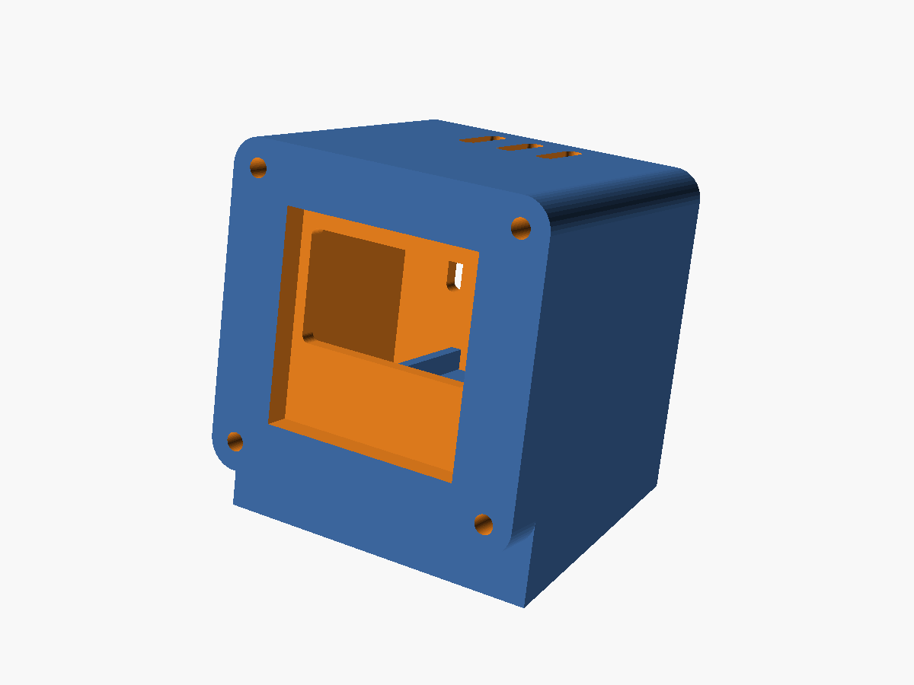
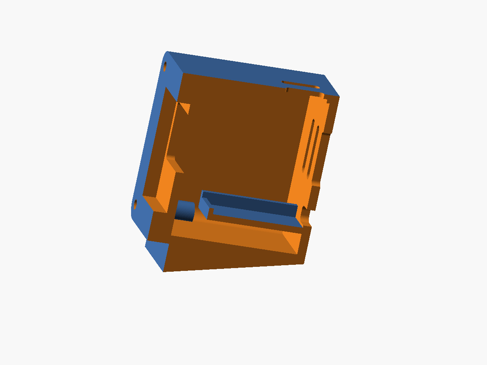

# Case

`deskbuddy_case.scad` is a two-part case: a **bezel** the OLED drops into, and
a **shell** behind it - a closed box, 35 mm deep, the exact outline of the
face, leaning back 12 degrees. The Super Mini lies on a shelf inside with its
USB-C port through the back wall; the touch pad tapes to the inside of the
top. From the front, nothing shows but the face. Four **M2x10** self-tapping
screws hold it together, heads countersunk in the bezel (x8 only bites
3-4 mm of post through the 5.7 mm bezel; x10 gets a proper grip).





```
        side view                         inside, from the front

     ┌────────────┐  ← top vents          ┌──────────────────────┐
     │ face       │                       │ ○                  ○ │ ← screw posts
    /│            │                       │      OLED pocket     │
   / │  35 mm     │ ← back vents          │      (in bezel)      │
  /  │  deep      ├─ USB-C slot           │                      │
 /   └────────────┘                       │   ┌──────────────┐   │ ← MCU shelf,
 ────────────────────  desk               │ ○ │  Super Mini  │ ○ │   USB to the back
                                          └───┴──────────────┴───┘
```

It is parametric and **untested on a printer** - 0.96" OLED boards vary by a
millimetre between batches. Put calipers on yours and check these first:

| Variable | What to measure |
| --- | --- |
| `oled_pcb_w` / `oled_pcb_h` | the module PCB, not the glass |
| `oled_glass_t` | how far the glass stands proud of the PCB |
| `oled_window_dy` | the active strip sits high on the board - nudge until centred |
| `mcu_w` / `mcu_l` | the Super Mini; `usb_w` / `usb_h` if the slot binds |
| `case_d` | shell depth, 35 mm by default |
| `lean` | tilt; 12 degrees suits a desk at arm's length |
| `fit` | global clearance; raise to 0.5 if parts bind |
| `touch_wall` | plastic left under the touch electrode, 1.2 mm; go to 1.0 if touches are still weak |

## The BOOT button is inside the box

The onboard BOOT button has been the "poke" button. Enclosed, you can't reach
it. Two options:

- Rely on the touch pad (tap = hello, hold = pet) - honestly the better
  interaction anyway.
- Set `button_d` to `6.2` (or `12.2`) for a round hole in the bezel's bottom
  right, and wire a panel-mount momentary button to GPIO9 and GND. The
  firmware doesn't care which button it is.

## Assembly

1. Print the **bezel** first and test-fit the OLED before committing to the
   shell. The module drops into the pocket from behind, glass against the
   front; the pin header carries on into the shell. The lean keeps it pressed
   against the front; a strip of foam tape on the back of the PCB stops it
   rattling if the fit is loose.
2. Wire the OLED (4 wires) and the touch pad (3) to the Super Mini with
   ~60 mm leads. The **touch pad goes under the recess in the top wall**,
   near the front, where the plastic is thinned to 1.2 mm. The TTP223's own
   pad is small and marginal through a case wall, so give it a bigger
   electrode: a 25 x 25 mm square of copper or aluminium tape pressed flat
   into the recess, joined to the module's sensing pad with a short wire
   (most TTP223 boards have a through-hole or exposed edge on the pad for
   this). The pad side must face the plastic with no air gap - foam tape
   behind the module keeps it pressed. If the module has a capacitor
   populated at *Cs* / *C*, removing it raises sensitivity further (less
   capacitance = more sensitive; an empty footprint is already maximum).
3. Slide the Super Mini onto the shelf, USB-C end first, until the port sits
   in the back-wall slot. The side ribs locate it; the lip at the front stops
   it sliding forward.
4. Bezel on, four screws from the front into the posts.
5. USB-C cable in the back. Done.

## Printing on the P1S

- 0.2 mm layers, PLA or PETG, 3 walls, 15% infill, **no supports**.
- Both parts export already oriented: the bezel face-down, the shell
  back-wall-down with the open front upwards. Everything inside the shell -
  posts, shelf, ribs, vents - prints clean that way.
- Black filament makes the bezel disappear around the display, which is most
  of the EMO look. A dark grey or smoke-translucent front looks good too.

```sh
openscad -o bezel.stl -D 'part="bezel"' deskbuddy_case.scad
openscad -o shell.stl -D 'part="shell"' deskbuddy_case.scad
```

Opening the file with `part = "both"` shows the assembly standing on the desk
as it will sit; add `section = true` to cut the right half away and see
inside. `make case` from the repo root exports both STLs if `openscad` is on
your PATH.
